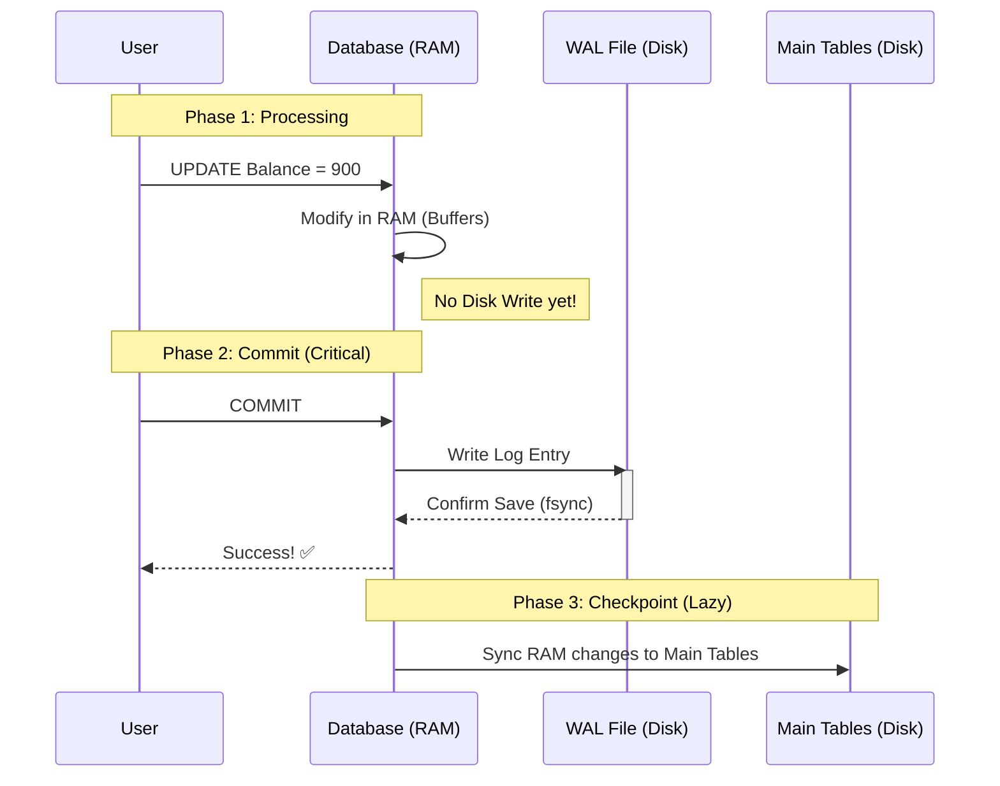

# Transaction Lifecycle: From RAM to Disk 🔄

Statement by Statement em jarugutundo chuddam:

## Visual Timeline



---

## Phase Breakdown

### Phase 1: In-Flight (Transaction Running) 🏃‍♂️

| Step | Location | Disk Write? |
|:---|:---|:---|
| User runs `UPDATE` | Change in RAM | ❌ No |
| Data Page modified | RAM Buffer Pool | ❌ No |
| Log entry created | Log Buffer (RAM) | ❌ No |

> ⚠️ Crash here = Automatic Rollback (No data saved)

---

### Phase 2: The COMMIT (Moment of Truth) ⚡

| Step | Action | Result |
|:---|:---|:---|
| 1 | Flush Log Buffer → WAL File | Force `fsync` |
| 2 | Mark transaction as COMMITTED | In WAL |
| 3 | Return "Success" to User | ✅ |

> 💡 Main "Balance" value inka Disk meeda update avvakapovachu. Kani **Log safe ga chalu!**

---

### Phase 3: Checkpoint (Lazy Update) 💤

```text
[Background Process - Every few minutes]
    ↓
Read dirty pages from RAM
    ↓
Write to actual Table files on Disk
    ↓
Mark checkpoint in WAL
    ↓
Old WAL entries can be deleted
```

---

## 🎯 Key Takeaways

| Phase | What Happens | If Crash? |
|:---|:---|:---|
| **In-Flight** | Changes in RAM only | Rollback automatically |
| **Commit** | WAL saved to disk | REDO from WAL |
| **Checkpoint** | Tables updated on disk | Already durable |
