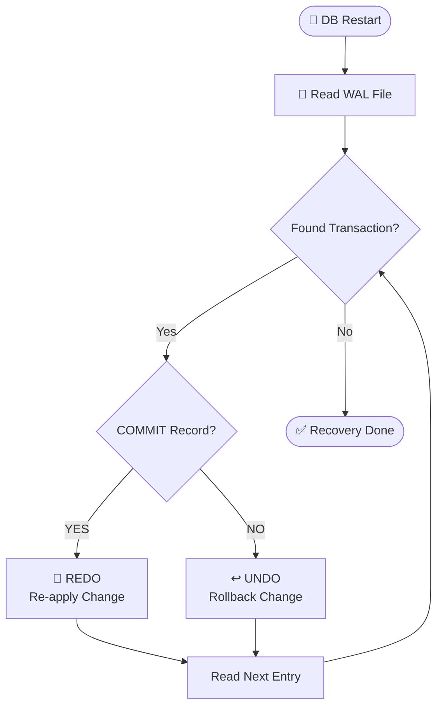

# Crash Recovery: The "Police Investigation" 🕵️‍♂️

Power poyi vachaka, Database start ayyi **WAL (Log File)** ni open chesi investigation start chestundi.

## Recovery Logic Flow



---

## Scenario A: Crash AFTER Commit (REDO) ✅

**Situation:** Commit kottav. Log Disk meeda padindi. Kani Checkpoint avvakamunde crash.

```text
WAL Log:
├── TX-101: UPDATE Balance 100 → 900
├── TX-101: COMMIT ✅
└── [End of File]

Data File: Balance = 100 (Old value - checkpoint didn't run)

Recovery Action:
1. See COMMIT record exists → Transaction was successful
2. Data shows 100, Log shows 900 → Mismatch!
3. REDO: Apply 900 to Data File
4. Result: Data restored correctly! 🎉
```

---

## Scenario B: Crash BEFORE Commit (UNDO) ❌

**Situation:** Log lo change rasindi, kani COMMIT kotte lopale crash.

```text
WAL Log:
├── TX-102: UPDATE Balance 100 → 900
└── [No COMMIT - End of File]

Recovery Action:
1. No COMMIT record → Transaction incomplete
2. UNDO: Ensure Balance stays 100
3. Result: Partial transaction safely ignored! 🎉
```

---

## The ARIES Algorithm (Industry Standard) 📚

Most production databases (PostgreSQL, MySQL, Oracle) use **ARIES** algorithm:

| Phase | Action |
|:---|:---|
| **Analysis** | Scan WAL, identify incomplete transactions |
| **Redo** | Re-apply ALL logged changes (committed or not) |
| **Undo** | Rollback uncommitted transactions |

---

## 🎯 Key Takeaways

| Condition | Action | Result |
|:---|:---|:---|
| COMMIT found | **REDO** | Malli apply chey |
| No COMMIT | **UNDO** | Reverse chey |
| WAL = Truth | Always trust log over data files | Consistency guaranteed |
