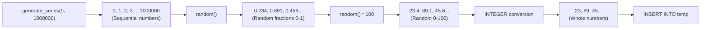
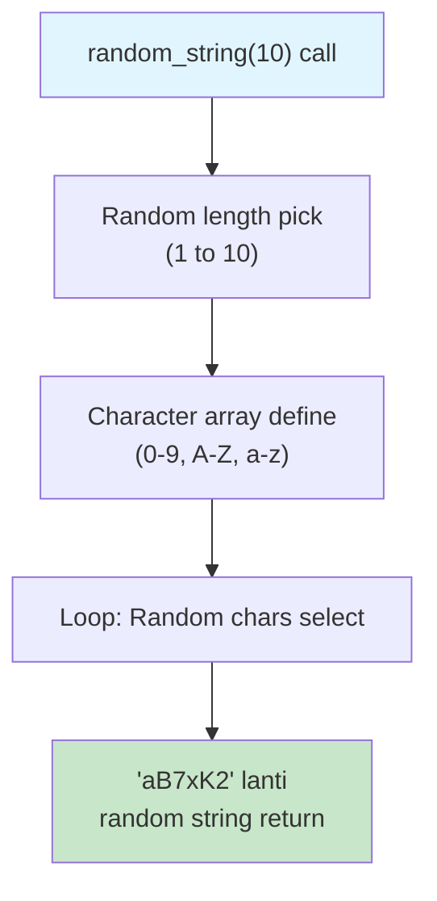

# 🗃️ Lesson 1: Large Test Dataset Create Cheyadam (Million Rows)

## 📌 Ee Lesson Lo Em Nerchukundaam?

Database indexing, partitioning lanti features test cheyyalanante **lakshala rows** (millions of rows) unna table kavali. Ee lesson lo Docker use chesi PostgreSQL lo 1 Million rows insert cheyyadam nerchukundaam.

---

## 🎯 Goal

| What | Details |
|------|---------|
| Database | PostgreSQL 13 (Docker lo) |
| Table | `temp` (temperatures store cheyadaniki) |
| Rows | **10,00,000** (1 Million) |
| Data | Random temperatures (0 to 100) |

---

## 🛠️ Prerequisites

- **Docker** installed undaali
- Terminal/Command Prompt access

---

## 📝 Step-by-Step Commands

### Step 1: PostgreSQL Container Start Cheyydam

```bash
docker run --name pg1 -e POSTGRES_PASSWORD=postgres -d postgres:13
```

**Explanation:**

| Flag | Meaning |
|------|---------|
| `--name pg1` | Container ki "pg1" ani name pettaam |
| `-e POSTGRES_PASSWORD=postgres` | Postgres password set chestunnam |
| `-d` | Detached mode (background lo run avtundi) |
| `postgres:13` | PostgreSQL version 13 image use chestunnam |

> [!TIP]
> Port expose cheyyaledhu (`-p 5432:5432`) endukante container lopaliki ssh chesi direct ga commands run chestaam.

---

### Step 2: Container Lopaliki Enter Avdam (psql shell)

```bash
docker exec -it pg1 psql -U postgres
```

**Explanation:**

| Flag | Meaning |
|------|---------|
| `exec` | Running container lo command run chey |
| `-it` | Interactive + Terminal mode |
| `pg1` | Mana container name |
| `psql` | PostgreSQL command line tool |
| `-U postgres` | Username: postgres |

> [!NOTE]
> Ee command run chesaaka, meeeru PostgreSQL shell lopaliki enter avtaaru. Prompt `postgres=#` laga kanipistundi.

---

### Step 3: Table Create Cheyydam

```sql
CREATE TABLE temp (t INTEGER);
```

**Explanation:**

- `temp` - Table name (temperatures kosam)
- `t` - Column name  
- `INTEGER` - Data type (whole numbers)

```
┌─────────────────────┐
│       temp          │
├─────────────────────┤
│   t (INTEGER)       │
├─────────────────────┤
│   (empty for now)   │
└─────────────────────┘
```

---

### Step 4: 1 Million Rows Insert Cheyydam 🚀

```sql
INSERT INTO temp (t) SELECT random()*100 FROM generate_series(0, 1000000);
```

**Ee command lo magic enti?**



**Breaking it down:**

| Part | Em Chestundi |
|------|--------------|
| `generate_series(0, 1000000)` | 0 to 10,00,000 sequential numbers generate chestundi |
| `random()` | Random fraction return chestundi (like 0.7234) |
| `random() * 100` | 0 to 100 range lo random number |
| `INTEGER` column | Automatic గా decimal values integers గా convert avtayi |

> [!IMPORTANT]
> **Index lekapothe** - Ee INSERT chala fast ga complete avtundi
> **Index unte** - Konchem slow avtundi (each insert ki index update avvali kabatti)

---

### Step 5: Data Verify Cheyydam

**Sample data chooddam:**

```sql
SELECT t FROM temp LIMIT 10;
```

**Output Example:**

```
 t  
----
 42
 87
 13
 56
 91
 28
 74
 39
 65
 8
(10 rows)
```

**Total count check:**

```sql
SELECT COUNT(*) FROM temp;
```

**Output:**

```
  count  
---------
 1000001
(1 row)
```

> [!NOTE]
> 1000001 rows vachayi (0 to 1000000 = 1000001 numbers)

---

## 🎨 Visual Summary

```
┌────────────────────────────────────────────────────────────────┐
│                    COMPLETE WORKFLOW                           │
├────────────────────────────────────────────────────────────────┤
│                                                                │
│  Terminal 1                    Terminal 2                      │
│  ─────────                    ─────────                        │
│  docker run --name pg1        docker exec -it pg1              │
│  -e POSTGRES_PASSWORD=...     psql -U postgres                 │
│  -d postgres:13                                                │
│         │                            │                         │
│         │                            ▼                         │
│         │                     ┌────────────────┐               │
│         └────────────────────►│  PostgreSQL    │               │
│                               │    Shell       │               │
│                               └───────┬────────┘               │
│                                       │                        │
│                                       ▼                        │
│                               CREATE TABLE temp                │
│                                       │                        │
│                                       ▼                        │
│                               INSERT 1 Million                 │
│                               rows using                       │
│                               generate_series()                │
│                                       │                        │
│                                       ▼                        │
│                               ✅ Ready for                     │
│                               Index Testing!                   │
│                                                                │
└────────────────────────────────────────────────────────────────┘
```

---

## 🔧 Bonus: Multiple Columns Add Cheyydam

Oka column kaadu, multiple columns kavaalante:

```sql
CREATE TABLE temp2 (
    t1 INTEGER,
    t2 INTEGER,
    t3 INTEGER
);

INSERT INTO temp2 (t1, t2, t3) 
SELECT 
    random()*100,      -- First column
    random()*50,       -- Second column  
    random()*200       -- Third column
FROM generate_series(0, 1000000);
```

**Character/String columns kavaalante:**

```sql
-- ASCII conversion use chesi random characters generate cheyyachu
SELECT chr((random()*26 + 65)::integer);  -- Random A-Z character
```

---

## 📊 Quick Reference - All Commands

```bash
# Step 1: Start PostgreSQL Container
docker run --name pg1 -e POSTGRES_PASSWORD=postgres -d postgres:13

# Step 2: Enter PostgreSQL Shell
docker exec -it pg1 psql -U postgres
```

```sql
-- Step 3: Create Table
CREATE TABLE temp (t INTEGER);

-- Step 4: Insert 1 Million Rows
INSERT INTO temp (t) SELECT random()*100 FROM generate_series(0, 1000000);

-- Step 5: Verify Data
SELECT t FROM temp LIMIT 10;
SELECT COUNT(*) FROM temp;
```

---

## 🧠 Key Takeaways

1. **`generate_series()`** - PostgreSQL built-in function, sequential numbers generate chestundi
2. **`random()`** - 0 to 1 madhyalo random fraction return chestundi
3. **Large dataset** - Indexing, partitioning test cheyadaniki essential
4. **Docker** - Quick database setup ki perfect tool
5. **No port exposure needed** - Container lopaliki exec chesi work cheyyachu

---

## ❓ Common Questions

**Q: Generate series lo 1000000 ki badulu 10000000 (1 Crore) pettacha?**
> A: Avunu! Kaani time ekkuva padthundi. System resources based on decide cheyyandi.

**Q: Container stop chesaaka data pothunda?**
> A: Yes! Docker container delete chesthe data pothu. Data persist cheyyalanante volume mount cheyyali:
>
> ```bash
> docker run --name pg1 -e POSTGRES_PASSWORD=postgres -v pgdata:/var/lib/postgresql/data -d postgres:13
> ```

**Q: Different database (MySQL, MongoDB) lo same cheyyacha?**
> A: Avunu, kaani syntax different. MySQL lo `RAND()`, loops use chestaam.

---

## ➡️ Next Lesson

Ee million rows table use chesi **Index create cheyadam** and **Performance difference** chooddam!

---

# 🗃️ Bonus: Hussein's Employee Table Setup (11 Million Rows)

## 📌 Alternative Approach - Employee Table with Random Names

Hussein garu video lo employees table tho 11 million rows create chesaru. Ee approach chooddam:

### Step 1: Docker PostgreSQL Start

```bash
docker run --name pg -e POSTGRES_PASSWORD=postgres -d postgres
docker start pg
```

### Step 2: PostgreSQL Shell Access

```bash
docker exec -it pg psql -U postgres
```

### Step 3: Employees Table Create

```sql
CREATE TABLE employees(
    id SERIAL PRIMARY KEY, 
    name TEXT
);
```

**Table Structure:**

| Column | Type | Constraints |
|--------|------|-------------|
| `id` | SERIAL (auto-increment) | PRIMARY KEY (automatic index) |
| `name` | TEXT | No index (testing kosam) |

> [!IMPORTANT]
> **PRIMARY KEY** automatic ga **B-Tree index** create chestundi. So `id` column already indexed!

### Step 4: Random String Generator Function

```sql
CREATE OR REPLACE FUNCTION random_string(length INTEGER) RETURNS TEXT AS 
$$
DECLARE
  chars TEXT[] := '{0,1,2,3,4,5,6,7,8,9,A,B,C,D,E,F,G,H,I,J,K,L,M,N,O,P,Q,R,S,T,U,V,W,X,Y,Z,a,b,c,d,e,f,g,h,i,j,k,l,m,n,o,p,q,r,s,t,u,v,w,x,y,z}';
  result TEXT := '';
  i INTEGER := 0;
  length2 INTEGER := (SELECT TRUNC(RANDOM() * length + 1));
BEGIN
  IF length2 < 0 THEN
    RAISE EXCEPTION 'Given length cannot be less than 0';
  END IF;
  FOR i IN 1..length2 LOOP
    result := result || chars[1+RANDOM()*(ARRAY_LENGTH(chars, 1)-1)];
  END LOOP;
  RETURN result;
END;
$$ LANGUAGE plpgsql;
```

**Function Em Chestundi:**



### Step 5: 1 Million Rows Insert 🚀

```sql
INSERT INTO employees(name)
(SELECT random_string(10) FROM generate_series(0, 1000000));
```

> [!TIP]
> Ee command **chala time** padthundi (minutes). Why?
>
> - 1 million random strings generate chestundi
> - Each string variable length (1-10 chars)
> - PRIMARY KEY index update chestundi each insert ki

**Progress Check:**

```sql
SELECT COUNT(*) FROM employees;
-- Output: 1000001 rows
```

### Step 6: Sample Data Chooddam

```sql
SELECT * FROM employees LIMIT 5;
```

**Sample Output:**

```
 id  |   name    
-----+-----------
   1 | aB7xK2
   2 | Z4mN8pQ
   3 | 5tYuR
   4 | kL9wE6vM
   5 | 3nP
```

---

## 🔍 Comparison: temp vs employees

| Feature | `temp` Table | `employees` Table |
|---------|--------------|-------------------|
| **Columns** | 1 (simple integer) | 2 (id + text) |
| **Data Type** | INTEGER | SERIAL + TEXT |
| **Index** | Initially none | PRIMARY KEY indexed |
| **Insert Speed** | Very fast | Slower (index updates) |
| **Use Case** | Basic indexing demo | Text search, complex queries |
| **Size** | Smaller | Larger (variable text) |

---

## 📊 All Commands - Quick Reference

### Temp Table Setup (Simple)

```bash
docker run --name pg1 -e POSTGRES_PASSWORD=postgres -d postgres:13
docker exec -it pg1 psql -U postgres
```

```sql
CREATE TABLE temp (t INTEGER);
INSERT INTO temp (t) SELECT random()*100 FROM generate_series(0, 1000000);
```

### Employee Table Setup (Complex)

```bash
docker run --name pg -e POSTGRES_PASSWORD=postgres -d postgres
docker exec -it pg psql -U postgres
```

```sql
CREATE TABLE employees(id SERIAL PRIMARY KEY, name TEXT);

CREATE OR REPLACE FUNCTION random_string(length INTEGER) RETURNS TEXT AS 
$$
DECLARE
  chars TEXT[] := '{0,1,2,3,4,5,6,7,8,9,A,B,C,D,E,F,G,H,I,J,K,L,M,N,O,P,Q,R,S,T,U,V,W,X,Y,Z,a,b,c,d,e,f,g,h,i,j,k,l,m,n,o,p,q,r,s,t,u,v,w,x,y,z}';
  result TEXT := '';
  i INTEGER := 0;
  length2 INTEGER := (SELECT TRUNC(RANDOM() * length + 1));
BEGIN
  IF length2 < 0 THEN
    RAISE EXCEPTION 'Given length cannot be less than 0';
  END IF;
  FOR i IN 1..length2 LOOP
    result := result || chars[1+RANDOM()*(ARRAY_LENGTH(chars, 1)-1)];
  END LOOP;
  RETURN result;
END;
$$ LANGUAGE plpgsql;

INSERT INTO employees(name)(SELECT random_string(10) FROM generate_series(0, 1000000));
```

---

## 🧠 Key Differences

1. **SERIAL** - Auto-incrementing integer, manual ga values ivvakkarledu
2. **PRIMARY KEY** - Unique values + automatic B-Tree index
3. **TEXT vs INTEGER** - Variable length vs fixed size
4. **Function usage** - Complex data generation ki PostgreSQL functions powerful

---

## ➡️ Real Next Lesson

1. **Index Performance Testing** - With & without indexes
2. **EXPLAIN ANALYZE** - Query execution plans understand cheyadam
3. **Index Types** - B-Tree vs other index types
