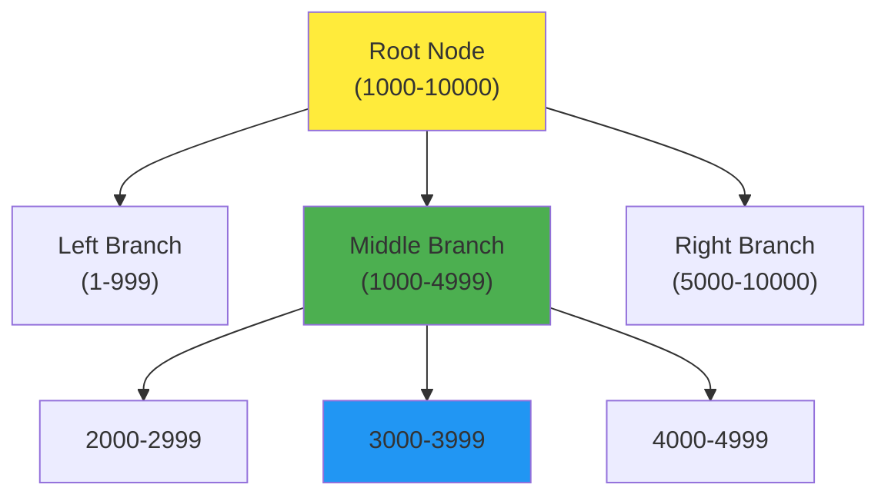

# 🔍 Lesson 2: What is Database Indexing?

## 📌 Index Ante Em La?

Imagine chesko - phone book (telephone directory) ni. Akkada A to Z varaku labels untayi. **Google** kosam search cheyyadam ante direct ga "G" section ki vellipothav. Alage database lo kuda, **index** ante oka **shortcut** laga undhi.

```
┌─────────────────────────────────────────────┐
│         Phone Book Analogy                  │
├─────────────────────────────────────────────┤
│  A  →  Apple Inc, Airtel...                 │
│  B  →  Bank of America, Burger King...      │
│  C  →  Coca Cola, Cisco...                  │
│  ...                                        │  
│  Z  →  Zebra Corp, Zoom...                  │
└─────────────────────────────────────────────┘
        ↓↓↓ Same Logic ↓↓↓
┌─────────────────────────────────────────────┐
│      Database Index                         │
├─────────────────────────────────────────────┤
│  Search for "Zebra"? → Direct ga Z section  │
│  No need to read A, B, C... Y               │
└─────────────────────────────────────────────┘
```

---

## 🎯 Index Definition

> [!NOTE]
> **Index** = Existing table meeda build chesina **separate data structure** that creates **shortcuts** for faster searching.

**Key Points:**

| Aspect | Explanation |
|--------|-------------|
| **Data Structure** | Table kaadu, oka special structure (B-Tree, LSM-Tree) |
| **Purpose** | Rapid searching kosam |
| **Trade-off** | Space extra padthundi, but search speed 1000x faster |
| **Auto-creation** | PRIMARY KEY automatic ga index create chestundi |

---

## 🌲 Index Types

### 1. B-Tree Index (Most Common)



**B-Tree Features:**

- **Binary search** logic tho work chestundi
- **Logarithmic time** - O(log n)
- **Balanced tree** - All paths equal length
- **Default choice** - PostgreSQL, MySQL lo

### 2. LSM-Tree (Log-Structured Merge Tree)

- Write-heavy workloads ki better
- NoSQL databases (Cassandra, RocksDB) use chestay
- Out of scope for basic indexing

---

## 🏗️ Table vs Index Structure

```
┌────────────────────────────────────────────────────────────┐
│                    ACTUAL TABLE (Heap)                     │
│                      11 Million Rows                       │
├────┬──────────┬────────────────────────────────────────────┤
│ ID │   Name   │  Other Columns (Address, Phone, etc.)     │
├────┼──────────┼────────────────────────────────────────────┤
│  1 │ aB7xK2   │  ...                                       │
│  2 │ Z4mN8pQ  │  ...                                       │
│  3 │ 5tYuR    │  ...                                       │
│... │ ...      │  ...                                       │
│11M │ ...      │  ...                                       │
└────┴──────────┴────────────────────────────────────────────┘
                        ↓
              (Very Heavy, Slow to Scan)

┌────────────────────────────────────────────────────────────┐
│                    INDEX on ID (B-Tree)                    │
│                   Smaller, Optimized                       │
├────┬────────────────────────────────────────────────────────┤
│ ID │  Pointer to Row Location in Heap                      │
├────┼────────────────────────────────────────────────────────┤
│  1 │  → Row location                                       │
│  2 │  → Row location                                       │
│... │  ...                                                  │
└────┴────────────────────────────────────────────────────────┘
              ↓
   (Lightweight, Lightning Fast to Scan)
```

---

## 🔥 Why Index Kavali?

### Without Index (Full Table Scan)

```sql
SELECT * FROM employees WHERE name = 'xyz';
```

**Process:**

```
Row 1: Check → Not match
Row 2: Check → Not match
Row 3: Check → Not match
...
Row 11,000,000: Check → Not match

Time Taken: 3 SECONDS! 😱
```

### With Index (Index Scan)

```sql
-- Same query, but index on 'name' column exists
SELECT * FROM employees WHERE name = 'xyz';
```

**Process:**

```
Index: Smart search structure
Level 1: 'xyz' between 'x' and 'z'? → Yes
Level 2: → Jump to 'xy' section
Level 3: → Found 'xyz'!

Time Taken: 47 MILLISECONDS! ⚡
```

---

## 📊 Performance Comparison

| Scenario | Without Index | With Index | Speedup |
|----------|--------------|------------|---------|
| **Search by ID** | Sequential scan<br/>3 seconds | Index scan<br/>0.1 milliseconds | **30,000x faster!** |
| **Search by Name** | Full table scan<br/>3 seconds | Index scan<br/>47 milliseconds | **65x faster!** |
| **Insert operation** | Fast | Slower (index update) | Trade-off |

---

## 🧠 Automatic Indexing

> [!IMPORTANT]
> **PRIMARY KEY** define chesthe, PostgreSQL automatic ga **unique B-Tree index** create chestundi!

```sql
CREATE TABLE employees(
    id SERIAL PRIMARY KEY,  -- ← Ee line automatic index create chestundi!
    name TEXT
);
```

**Check indexes:**

```sql
\d employees
```

**Output:**

```
Indexes:
    "employees_pkey" PRIMARY KEY, btree (id)
```

---

## 🎯 Key Takeaways

1. **Index = Phone book labels** - Shortcuts for searching
2. **B-Tree** most common index type
3. **PRIMARY KEY** = Automatic index
4. **Table (HEAP)** vs **Index** different data structures
5. **Trade-off:** Search speed ↑, Insert speed ↓, Storage ↑

---

## ❓ Common Questions

**Q: Every column meeda index pettoccha?**
> A: Technically yes, kaani **bad practice**!  
>
> - Insert/Update operations chala slow avtayi
> - Storage waste
> - Only frequently searched columns meeda pettandi

**Q: Index size entha untundi?**
> A: Table size kante **30-50% smaller** typically. Depends on:
>
> - Column data type
> - Number of indexed columns
> - Index type

**Q: Index manually create cheyyali anukuntunna, how?**
> A: Next lesson! `CREATE INDEX` command use chesi custom indexes create chestaamu.

---

## ➡️ Next Lesson Preview

Next lo nerchukundaam:

- **EXPLAIN ANALYZE** - Query execution plans choodadam
- **Index scan vs Sequential scan** - Actual difference
- **Manual index creation** on custom columns
