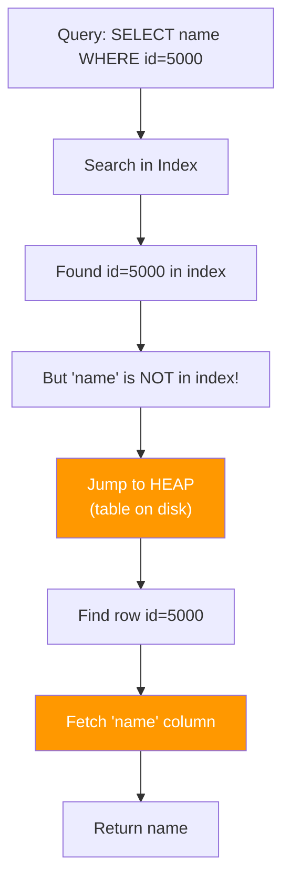

# ⚡ Lesson 4: Heap Fetches & Inline Queries - The Sweetest Optimization

## 📌 Heap Ante Em?

**Heap** = Actual table data store chesina place (disk meeda).

```
┌──────────────────────────────────────────────────────────┐
│                    DATABASE STORAGE                      │
├──────────────────────────────────────────────────────────┤
│                                                          │
│  ┌──────────────┐              ┌──────────────────────┐ │
│  │    INDEX     │              │      HEAP (Table)    │ │
│  │  (Smaller)   │              │     (Larger)         │ │
│  ├──────────────┤              ├──────────────────────┤ │
│  │ id: 1 → ptr  │─────────────→│ 1 | aB7xK2 | data   │ │
│  │ id: 2 → ptr  │─────────────→│ 2 | Z4mN8p | data   │ │
│  │ id: 3 → ptr  │─────────────→│ 3 | 5tYuR  | data   │ │
│  └──────────────┘              └──────────────────────┘ │
│                                                          │
│     Fast Search               Actual Complete Data      │
│     (Organized)               (Unorganized, Heavy)      │
└──────────────────────────────────────────────────────────┘
```

---

## 🎯 Heap Fetch Ante Em?

Index lo data ledu, table (heap) ki velli data teskuravadam.

### Example 1: No Heap Fetch (Inline Query) ⚡

```sql
EXPLAIN ANALYZE 
SELECT id FROM employees WHERE id = 2000;
```

**Output:**

```
Index Scan using employees_pkey on employees
  (cost=0.43..8.45 rows=1 width=4)
  (actual time=0.045..0.047 rows=1 loops=1)
  
  Index Cond: (id = 2000)
  
Execution Time: 0.6 ms
```

**Process Flow:**


**Why no heap fetch?**

- `id` column index lo already undi
- Extra information kavali kaadu
- Index lone query complete!

> [!NOTE]
> This is called an **Index-Only Scan** or **Inline Query** - database engineer ki sweetest thing! 🍰

---

## 🔍 Example 2: With Heap Fetch (Slower) 🐢

```sql
EXPLAIN ANALYZE 
SELECT name FROM employees WHERE id = 5000;
```

**Output:**

```
Index Scan using employees_pkey on employees
  (cost=0.43..8.45 rows=1 width=10)
  (actual time=0.102..2.567 rows=1 loops=1)
  
  Index Cond: (id = 5000)
  Heap Fetches: 1            ← Ee line important!
  
Execution Time: 2.5 ms
```

**Process Flow:**



**Why slower?**

- Index scan = Fast (0.1 ms)
- **Heap fetch** = Slower (2.4 ms additional)
- Total = **2.5 ms** (still fast, but not as sweet)

---

## 📊 Performance Comparison

| Query Type | Heap Fetch? | Time | Reason |
|------------|-------------|------|--------|
| `SELECT id WHERE id=2000` | ❌ No | 0.6 ms | id already in index |
| `SELECT name WHERE id=5000` | ✅ Yes | 2.5 ms | name NOT in index |
| `SELECT * WHERE id=5000` | ✅ Yes | 2.5 ms | All columns needed → heap |

**Time Breakdown:**

```
Index Scan:  ████ 0.1 ms
Heap Fetch:  ████████████████████ 2.4 ms
             ─────────────────────────
Total:       2.5 ms
```

---

## 🎨 Visual: Index Structure

### Primary Key Index (id)

```
┌──────────────────────────────────────┐
│     employees_pkey (B-Tree)          │
├──────────┬───────────────────────────┤
│ id       │ → Row Pointer (Location)  │
├──────────┼───────────────────────────┤
│ 1        │ → 0x7f3a...               │
│ 2        │ → 0x7f3b...               │
│ ...      │ ...                       │
│ 5000     │ → 0x8c2d...               │
└──────────┴───────────────────────────┘

NOTICE: Only 'id' stored, NOT 'name'!
```

### If We Want Inline Query for Name?

Create a **covering index**:

```sql
CREATE INDEX idx_id_name ON employees(id, name);
```

Now index looks like:

```
┌──────────────────────────────────────────┐
│     idx_id_name (B-Tree)                 │
├──────────┬──────────┬────────────────────┤
│ id       │ name     │ → Row Pointer      │
├──────────┼──────────┼────────────────────┤
│ 1        │ aB7xK2   │ → 0x7f3a...        │
│ 5000     │ xYz123   │ → 0x8c2d...        │
└──────────┴──────────┴────────────────────┘

NOW: Both id AND name available in index!
```

**Result:**

```sql
EXPLAIN ANALYZE 
SELECT name FROM employees WHERE id = 5000;
```

```
Index Only Scan using idx_id_name on employees
  (actual time=0.089..0.091 rows=1 loops=1)
  
  Index Cond: (id = 5000)
  Heap Fetches: 0            ← NO heap fetch! ⚡
  
Execution Time: 0.1 ms
```

**Improvement:** 2.5 ms → 0.1 ms = **25x faster!**

---

## 🧩 Why Heap Fetches Are Expensive

### 1. **Different Data Structure**

```
Index (B-Tree):     Heap (Table):
- Organized         - Unorganized
- Small size        - Large size  
- In memory         - Often on disk
- Fast access       - Slower access
```

### 2. **Disk I/O Required**

```
Memory (RAM):       Disk (SSD/HDD):
- Nanoseconds       - Milliseconds
- 1000x faster      - Slower

Index usually in RAM → Fast
Heap often on disk  → Slow
```

### 3. **Page Reads**

PostgreSQL reads data in **pages** (8 KB blocks):

```
┌────────────────────────────────────┐
│         Heap Page (8 KB)           │
├────────────────────────────────────┤
│ Row 1 (1 KB)                       │
│ Row 2 (1 KB)  ← We need this!     │
│ Row 3 (1 KB)                       │
│ ... (rest of page)                 │
└────────────────────────────────────┘

Even for 1-row, entire 8KB page read!
```

---

## 🎯 When Heap Fetches Happen

| Scenario | Heap Fetch? | Reason |
|----------|-------------|--------|
| `SELECT id WHERE id=100` | ❌ | id in PRIMARY KEY index |
| `SELECT name WHERE id=100` | ✅ | name NOT in id index |
| `SELECT * WHERE id=100` | ✅ | All columns needed |
| `SELECT id, name WHERE id=100` | ✅ | name not in id index |
| `SELECT COUNT(*) WHERE id>100` | ❌ (sometimes) | Index sufficient for count |

---

## 🛠️ How to Avoid Heap Fetches

### Strategy 1: Select Only Indexed Columns

```sql
-- Bad (heap fetch needed)
SELECT name FROM employees WHERE id = 100;

-- Good (no heap fetch)
SELECT id FROM employees WHERE id = 100;
```

### Strategy 2: Create Covering Index

```sql
CREATE INDEX idx_covering ON employees(id, name);

-- Now this is fast!
SELECT name FROM employees WHERE id = 100;
```

### Strategy 3: Use `INCLUDE` (PostgreSQL 11+)

```sql
CREATE INDEX idx_id_include_name ON employees(id) INCLUDE (name);
```

**Difference:**

- **Regular index**: Both columns used for searching AND storage
- **INCLUDE**: Only `id` for searching, `name` just stored (lighter)

---

## 📊 Real Performance Example

Hussein's video results:

### Query 1: Inline (No Heap Fetch)

```sql
SELECT id FROM employees WHERE id = 2000;
```

**Result:** 0.6 ms ⚡

### Query 2: With Heap Fetch

```sql
SELECT name FROM employees WHERE id = 5000;
```

**Result:** 2.5 ms 🐢

### Difference

```
Heap fetch cost: 2.5 - 0.6 = 1.9 ms

For 1 row, 1.9 ms doesn't matter.
For 1 million rows? 1.9 million ms = 31 MINUTES! 😱
```

---

## 🧠 Database Engineer's Dream Query

> [!TIP]
> "If the information is available in the index, that is the **sweetest query** to a database engineer!"  
> — Hussein Nasser

**Why?**

- No disk I/O
- No page reads
- Index usually cached in RAM
- **Minimal latency**

**Goal:** Design queries + indexes so that heap fetches minimized!

---

## 🎯 Key Takeaways

1. **Heap** = Actual table data on disk
2. **Heap fetch** = Extra work to get data not in index
3. **Inline query** = All data from index, no heap fetch (sweetest!)
4. **Covering indexes** include extra columns to avoid heap fetches
5. **Trade-off:** Covering indexes larger, but queries faster
6. Select only needed columns to potentially avoid heap fetches

---

## ❓ Common Questions

**Q: Every index covering index cheyoccha?**
> A: No! Bad practice. Covering indexes pedda avutayi, insert/update slow. Only frequently queried columns kosam.

**Q: `SELECT *` always heap fetch chesthunda?**
> A: Almost always yes (unless very special covering index). That's why `SELECT *` discouraged!

**Q: Heap fetches always bad aa?**
> A: No, unavoidable sometimes. But minimize cheyadam goal.

**Q: SSD unte heap fetches fast aa?**
> A: Yes, HDD kante fast. But still slower than index-only scan. RAM > SSD > HDD.

---

## ➡️ Next Lesson

**Coming up:**

- **Index creation** on custom columns (`name`)
- **Performance before/after** index
- **LIKE operator** with indexes - why it fails!
