# 🏗️ Lesson 5: Creating & Testing Indexes

## 📌 Index Ela Create Cheyali?

Mana employees table lo `name` column meeda index ledu. Ippudu manual ga create chedam!

---

## 🎯 Before Index - Performance Check

### Query Without Index

```sql
EXPLAIN ANALYZE 
SELECT id FROM employees WHERE name = 'xZs';
```

**Output:**

```
Gather (cost=1000.00..128750.11 rows=1 width=4) 
  (actual time=1456.234..3024.567 rows=0 loops=1)
  
  Workers Planned: 2
  Workers Launched: 2
  
  -> Parallel Seq Scan on employees
       Filter: (name = 'xZs'::text)
       Rows Removed by Filter: 11000001
       
Planning Time: 0.834 ms
Execution Time: 3024 ms  ← 3 SECONDS! 😱
```

**Analysis:**

| Metric | Value | Problem |
|--------|-------|---------|
| **Scan Type** | Parallel Sequential Scan | Full table scan! |
| **Rows Scanned** | 11 million | All rows checked |
| **Execution Time** | 3024 ms | Extremely slow |
| **Workers** | 2 parallel workers | Even with parallelization, slow |

**Visual Process:**

```
┌────────────────────────────────────────────────┐
│         SEQUENTIAL SCAN (No Index)             │
├────────────────────────────────────────────────┤
│                                                │
│  Worker 1:          Worker 2:                  │
│  ─────────          ─────────                  │
│  Row 1: Check       Row 5.5M: Check            │
│  Row 2: Check       Row 5.5M+1: Check          │
│  Row 3: Check       ...                        │
│  ...                Row 11M: Check             │
│  Row 5.5M: Check                               │
│                                                │
│  ALL 11 MILLION ROWS CHECKED! 🐌              │
└────────────────────────────────────────────────┘
```

---

## 🔨 Creating the Index

### Step 1: Create Index Command

```sql
CREATE INDEX employees_name ON employees(name);
```

**Syntax Breakdown:**

| Part | Meaning |
|------|---------|
| `CREATE INDEX` | Index create cheyyi command |
| `employees_name` | Index ki name (convention: `tablename_columnname`) |
| `ON employees` | Ee table meeda |
| `(name)` | Ee column(s) meeda index |

**What Happens Behind the Scenes:**

```mermaid
flowchart TD
    A["CREATE INDEX command"] --> B["Scan entire employees table<br/>(11M rows)"]
    B --> C["Sort data by 'name' column"]
    C --> D["Build B-Tree structure"]
    D --> E["Store index on disk"]
    E --> F["✅ Index ready!"]
    
    style A fill:#2196f3,color:#fff
    style F fill:#4caf50,color:#fff
```



> [!WARNING]
> Index creation chala **time padthundi** for large tables!
>
> - 1M rows: ~30 seconds  
> - 11M rows: ~5 minutes  
> - 100M rows: ~1 hour

**Progress Check:**

```sql
-- Different terminal lo check cheyochu
SELECT * FROM pg_stat_progress_create_index;
```

---

## ⚡ After Index - Performance Re-Check

### Same Query, Now With Index

```sql
EXPLAIN ANALYZE 
SELECT id FROM employees WHERE name = 'xZs';
```

**Output:**

```
Bitmap Heap Scan on employees 
  (cost=4.44..8.46 rows=1 width=4) 
  (actual time=0.045..0.047 rows=0 loops=1)
  
  Recheck Cond: (name = 'xZs'::text)
  
  -> Bitmap Index Scan on employees_name
       (cost=0.00..4.44 rows=1 width=0)
       (actual time=0.042..0.042 rows=0 loops=1)
       
       Index Cond: (name = 'xZs'::text)
       
Planning Time: 0.123 ms
Execution Time: 0.068 ms  ← 47 MILLISECONDS! ⚡
```

**Analysis:**

| Metric | Before Index | After Index | Improvement |
|--------|--------------|-------------|-------------|
| **Scan Type** | Parallel Seq Scan | Bitmap Index Scan | ✅ |
| **Execution Time** | 3024 ms | 47 ms | **64x faster!** |
| **Rows Scanned** | 11 million | ~10 (estimate) | 99.9999% fewer |
| **Workers Needed** | 2 | 0 | No parallelization needed |

**Visual Process:**

```
┌────────────────────────────────────────────────┐
│          BITMAP INDEX SCAN (With Index)        │
├────────────────────────────────────────────────┤
│                                                │
│  Step 1: Search index (B-Tree)                │
│           'xZs' → Not found                    │
│           Time: 0.042 ms                       │
│                                                │
│  Step 2: Return empty (no heap fetch needed)  │
│           Time: 0.005 ms                       │
│                                                │
│  Total: 0.047 ms ⚡                            │
└────────────────────────────────────────────────┘
```

---

## 📊 Performance Comparison Chart

### Time Comparison

```
WITHOUT INDEX:
████████████████████████████████████████████████████████████ 3024 ms

WITH INDEX:
█ 47 ms
```

### Rows Scanned

```
WITHOUT INDEX:
████████████████████████████████████████████████████████ 11,000,000 rows

WITH INDEX:
█ ~10 rows
```

---

## 🎨 Understanding Bitmap Scan

### What is Bitmap Scan?

Two-step process:

**Step 1: Bitmap Index Scan**

```
┌──────────────────────────────────┐
│      employees_name Index        │
├──────────────────────────────────┤
│ 'abc' → Rows: 5, 127, 890        │
│ 'xyz' → Rows: 12, 99             │
│ 'xZs' → (Not found)              │
└──────────────────────────────────┘
        ↓
   Create bitmap of matching rows
```

**Step 2: Bitmap Heap Scan**

```
Go to heap and fetch only those rows
marked in bitmap (if any)
```

**Why "Bitmap"?**

- Creates a bitmap (0s and 1s) of matching rows
- Fetches in **sequential order** from heap
- Efficient for multiple matching rows

---

## 🔍 Different Query - With Results

### Query That Finds Data

```sql
EXPLAIN ANALYZE 
SELECT id FROM employees WHERE name = 'aB7xK2';
```

**Assuming 'aB7xK2' exists:**

```
Bitmap Heap Scan on employees
  (cost=4.44..8.46 rows=1 width=4)
  (actual time=0.089..0.091 rows=1 loops=1)
  
  Recheck Cond: (name = 'aB7xK2'::text)
  Heap Blocks: exact=1
  
  -> Bitmap Index Scan on employees_name
       (cost=0.00..4.44 rows=1 width=0)
       (actual time=0.045..0.045 rows=1 loops=1)
       
       Index Cond: (name = 'aB7xK2'::text)
       
Execution Time: 0.15 ms
```

**Process:**


**Timings:**

- Index scan: 0.045 ms
- Heap fetch: 0.045 ms
- Total: 0.15 ms (still very fast!)

---

## 🏆 Index Creation Best Practices

### 1. Check Existing Indexes First

```sql
-- List all indexes on employees table
\d employees

-- Or via query
SELECT indexname, indexdef 
FROM pg_indexes 
WHERE tablename = 'employees';
```

**Output:**

```
       indexname        |                indexdef                
------------------------+----------------------------------------
 employees_pkey         | CREATE UNIQUE INDEX employees_pkey ...
 employees_name         | CREATE INDEX employees_name ...
```

### 2. Name Indexes Clearly

```sql
-- Good naming convention
CREATE INDEX idx_employees_name ON employees(name);
CREATE INDEX idx_employees_email ON employees(email);

-- Bad (unclear)
CREATE INDEX index1 ON employees(name);
```

### 3. Create Indexes During Off-Peak Hours

```sql
-- For production, use CONCURRENTLY
CREATE INDEX CONCURRENTLY idx_employees_name ON employees(name);
```

**Benefits:**

- Table accessible during creation
- No locks on table
- Takes longer, but production traffic unaffected

### 4. Monitor Index Size

```sql
SELECT 
    indexname,
    pg_size_pretty(pg_relation_size(indexname::regclass)) AS index_size
FROM pg_indexes 
WHERE tablename = 'employees';
```

**Sample Output:**

```
   indexname     | index_size 
-----------------+------------
 employees_pkey  | 214 MB
 employees_name  | 230 MB
```

---

## 🎯 When to Create Indexes

### **DO** Create Index On

✅ **Frequently searched columns**

```sql
WHERE user_id = 123      -- user_id needs index
WHERE email = 'a@b.com'  -- email needs index
```

✅ **Foreign key columns**

```sql
CREATE INDEX idx_orders_user_id ON orders(user_id);
```

✅ **Columns used in ORDER BY**

```sql
SELECT * FROM posts ORDER BY created_at DESC;
-- created_at should have index
```

✅ **Columns in JOIN conditions**

```sql
SELECT * FROM orders o 
JOIN users u ON o.user_id = u.id;
-- Both user_id and id should be indexed
```

### **DON'T** Create Index On

❌ **Small tables** (< 1000 rows)

- Full scan faster than index scan

❌ **Columns with low cardinality**

```sql
-- Bad: Only 2 distinct values
CREATE INDEX idx_users_gender ON users(gender);  
-- 'M' or 'F' - not useful!
```

❌ **Frequently updated columns**

- Index updates slow down INSERT/UPDATE

❌ **Very large text columns**

- Huge index size, limited benefit

---

## 🧪 Testing Index Effectiveness

### Step-by-Step Test Process

```sql
-- 1. Check current performance
EXPLAIN ANALYZE SELECT * FROM employees WHERE name = 'abc';

-- 2. Create index
CREATE INDEX idx_employees_name ON employees(name);

-- 3. Update statistics (important!)
ANALYZE employees;

-- 4. Re-test same query
EXPLAIN ANALYZE SELECT * FROM employees WHERE name = 'abc';

-- 5. Compare results!
```

---

## 🧠 Key Takeaways

1. **CREATE INDEX** to manually add indexes on columns
2. Index creation **takes time** on large tables
3. **Bitmap Index Scan** = Two-step index + heap process
4. Index dramatically improves search performance (64x in our example!)
5. Use **CONCURRENTLY** in production
6. Not all columns need indexes - choose wisely!
7. Always **test before/after** to confirm improvement

---

## ❓ Common Questions

**Q: Index create chesthe storage entha extra avthundi?**
> A: Typically **30-50%** extra storage. Our 214 MB table → 230 MB index.

**Q: Multiple indexes oka column meeda pettoccha?**
> A: Technically yes, kani usually pointless. Different index types (B-Tree, GiST, GIN) ki use cheyyochu.

**Q: Index delete cheyyalanante?**
>
> ```sql
> DROP INDEX employees_name;
> ```

**Q: Index automatically update avthunda data change ainapudu?**
> A: **Yes!** Every INSERT/UPDATE/DELETE automatic ga index update chestundi. That's why writes slower with many indexes.

---

## ➡️ Next Lesson

**Coming up:**

- **LIKE operator pitfalls** - Why `%abc%` doesn't use index
- **Partial indexes** for specific conditions
- **Multi-column indexes** for complex queries
