# 🎯 Lesson 7: Index Best Practices & Final Tips

## 📌 Hussein's Golden Rules

Video nundi key lessons + industry best practices combined!

---

## 🏆 Rule #1: Don't SELECT *

### The Problem

```sql
-- BAD ❌
SELECT * FROM employees WHERE id = 1000;
```

**Why bad?**

| Issue | Impact |
|-------|--------|
| **Fetches all columns** | Unnecessary data transfer |
| **Always requires heap fetch** | Can't use inline queries |
| **Network bandwidth waste** | Slow response |
| **Memory overhead** | Application server suffers |

### The Solution

```sql
-- GOOD ✅
SELECT id, name FROM employees WHERE id = 1000;

-- BEST ⚡ (if only need id)
SELECT id FROM employees WHERE id = 1000;
```

**Benefits:**

- Potential for **inline queries** (no heap fetch)
- Less data transfer
- Faster response time
- Better memory usage

---

## 🔍 Rule #2: Understand Query Planner Decisions

### Database is Smarter Than You Think

```sql
EXPLAIN ANALYZE SELECT * FROM employees WHERE id > 1000000;
```

**Possible output:**

```
Seq Scan on employees  ← Index exists but NOT used!
  Filter: (id > 1000000)
  Rows: 10000000
  
Execution Time: 2000 ms
```

**Why sequential scan when index exists?**

```mermaid
graph TD
    A["Planner Analysis"] --> B{"How many rows<br/>will query return?"}
    B -->|"< 5% of table"| C["Use Index Scan ✅<br/>Few rows, efficient"]
    B -->|"> 30% of table"| D["Use Seq Scan 🔄<br/>Many rows, cheaper"]
    
    style C fill:#4caf50,color:#fff
    style D fill:#ff9800,color:#fff
```



**Planner's Logic:**

| Rows to Return | Method | Reason |
|----------------|--------|--------|
| 1-100 rows | Index Scan | Pinpoint access |
| 100-1M rows | Bitmap Scan | Batch access |
| 1M+ rows (>30% table) | Seq Scan | Reading most of table anyway |

> [!NOTE]
> If query returns majority of table, sequential scan actually **faster** than index scan!

---

## 📊 Rule #3: Index Only What You Search

### Good Index Candidates ✅

```sql
-- Frequently used in WHERE
CREATE INDEX idx_users_email ON users(email);
SELECT * FROM users WHERE email = 'test@example.com';

-- JOIN conditions
CREATE INDEX idx_orders_user_id ON orders(user_id);
SELECT * FROM orders o JOIN users u ON o.user_id = u.id;

-- ORDER BY columns
CREATE INDEX idx_posts_created_at ON posts(created_at DESC);
SELECT * FROM posts ORDER BY created_at DESC LIMIT 10;

-- GROUP BY columns
CREATE INDEX idx_sales_product_id ON sales(product_id);
SELECT product_id, COUNT(*) FROM sales GROUP BY product_id;
```

### Bad Index Candidates ❌

```sql
-- Low cardinality (few distinct values)
CREATE INDEX idx_users_gender ON users(gender);  -- Only M/F
-- Waste of space, minimal benefit

-- Frequently updated columns
CREATE INDEX idx_products_stock_count ON products(stock_count);
-- Updated every sale → index constantly rebuilding

-- Very wide columns
CREATE INDEX idx_posts_content ON posts(content);
-- TEXT column → huge index

-- Columns never used in WHERE/JOIN
CREATE INDEX idx_users_middle_name ON users(middle_name);
-- Never searched → useless
```

---

## 🔧 Rule #4: Monitor Index Usage

### Check Index Usage Statistics

```sql
SELECT 
    schemaname,
    tablename,
    indexname,
    idx_scan,           -- Times index scanned
    idx_tup_read,       -- Tuples read from index
    idx_tup_fetch       -- Tuples fetched from table
FROM pg_stat_user_indexes
WHERE schemaname = 'public'
ORDER BY idx_scan ASC;  -- Unused indexes first
```

**Sample Output:**

```
 tablename  |     indexname      | idx_scan | idx_tup_read 
------------+--------------------+----------+--------------
 employees  | employees_pkey     | 1234567  | 1234567      ← Used heavily!
 employees  | employees_name     | 89234    | 89234        ← Good usage
 employees  | idx_unused         | 0        | 0            ← UNUSED! Delete?
```

### Drop Unused Indexes

```sql
-- Index never used in 6 months? Drop it!
DROP INDEX idx_unused;
```

**Benefits:**

- Faster INSERT/UPDATE/DELETE
- Less storage
- Simpler query planning

---

## 💾 Rule #5: Understand Index Size Trade-off

### Index Size Analysis

```sql
SELECT 
    tablename,
    pg_size_pretty(pg_total_relation_size(tablename::regclass)) AS total_size,
    pg_size_pretty(pg_relation_size(tablename::regclass)) AS table_size,
    pg_size_pretty(pg_total_relation_size(tablename::regclass) - 
                   pg_relation_size(tablename::regclass)) AS index_size
FROM pg_tables 
WHERE schemaname = 'public';
```

**Sample Output:**

```
 tablename | total_size | table_size | index_size 
-----------+------------+------------+------------
 employees | 650 MB     | 400 MB     | 250 MB     
```

**Analysis:**

- Table: 400 MB
- Indexes: 250 MB (62.5% of table!)
- **Total storage:** 650 MB

> [!WARNING]
> Too many indexes = Huge storage costs + Slow writes

---

## ⚡ Rule #6: Use Covering Indexes Wisely

### Problem Scenario

```sql
-- Frequently executed query
SELECT id, name, email FROM users WHERE email = 'test@example.com';
```

**Current indexes:**

```sql
-- Only email indexed
CREATE INDEX idx_users_email ON users(email);
```

**Process:**

1. Index scan on `email` ✅ Fast
2. Heap fetch for `name` ❌ Slow
3. Total: Medium speed

### Solution: Covering Index

```sql
CREATE INDEX idx_users_email_covering ON users(email, name);
-- Or with INCLUDE (PostgreSQL 11+)
CREATE INDEX idx_users_email_inc ON users(email) INCLUDE (name);
```

**Process now:**

1. Index scan finds `email` ✅
2. `name` already in index ✅ (Inline!)
3. No heap fetch needed ⚡
4. Total: Very fast!

**Performance:**

- Before: 2.5 ms
- After: 0.1 ms
- **Improvement: 25x faster!**

---

## 🎨 Rule #7: Choose Right Index Type

### B-Tree (Default)

```sql
CREATE INDEX idx_name ON table(column);  -- B-Tree by default
```

**Best for:**

- Exact matches: `WHERE id = 100`
- Range queries: `WHERE created_at > '2024-01-01'`
- Sorting: `ORDER BY name`
- Most general-purpose queries

### GIN (Generalized Inverted Index)

```sql
CREATE INDEX idx_tags ON posts USING gin(tags);
```

**Best for:**

- Array searches: `WHERE 'tag1' = ANY(tags)`
- Full-text search: `WHERE document @@ to_tsquery('search')`
- JSONB queries: `WHERE data @> '{"key": "value"}'`

### GiST (Generalized Search Tree)

```sql
CREATE INDEX idx_location ON places USING gist(location);
```

**Best for:**

- Geometric data: `WHERE point <-> '(0,0)' < 100`
- Full-text search (alternative to GIN)
- Range types

### Hash (Rare)

```sql
CREATE INDEX idx_hash ON table USING hash(column);
```

**Best for:**

- Only equality comparisons: `WHERE code = 'ABC'`
- **Rarely recommended** (B-Tree usually better)

---

## 🧪 Rule #8: Test in Production-Like Environment

### Development Testing

```sql
-- Small dataset (1000 rows)
EXPLAIN ANALYZE SELECT * FROM users WHERE email = 'test@example.com';
-- Result: Seq Scan (0.5 ms)
```

**Problem:** Works fine in dev, but...

### Production Reality

```sql
-- Large dataset (10 million rows)
EXPLAIN ANALYZE SELECT * FROM users WHERE email = 'test@example.com';
-- Result: Seq Scan (3000 ms) 😱
```

**Solution:**

1. **Create production-like dataset**

   ```sql
   -- Use generate_series for testing
   INSERT INTO users (email, name)
   SELECT 
       'user' || i || '@example.com',
       'User ' || i
   FROM generate_series(1, 10000000) AS i;
   ```

2. **Update statistics**

   ```sql
   ANALYZE users;
   ```

3. **Test queries**

   ```sql
   EXPLAIN ANALYZE SELECT ...;
   ```

---

## 🚀 Rule #9: Concurrent Index Creation

### Problem with Regular Index Creation

```sql
-- This LOCKS the table!
CREATE INDEX idx_users_email ON users(email);
```

**Impact:**

- Table locked during creation
- Production queries blocked
- Downtime for large tables

### Solution: CREATE INDEX CONCURRENTLY

```sql
CREATE INDEX CONCURRENTLY idx_users_email ON users(email);
```

**Benefits:**

- ✅ No table lock
- ✅ Queries continue running
- ✅ Zero downtime
- ⚠️ Takes longer to create

**Trade-off:**

| Aspect | Regular | CONCURRENTLY |
|--------|---------|--------------|
| **Lock** | Full table lock | No lock |
| **Speed** | Faster | Slower (2-3x) |
| **Production** | ❌ Avoid | ✅ Use this |
| **Failure handling** | Rollback | Manual cleanup needed |

---

## 📐 Rule #10: Regular Maintenance

### Update Statistics

```sql
-- Manual
ANALYZE employees;

-- Automatic (configure postgresql.conf)
autovacuum = on
```

**Why important?**

- Planner uses statistics for decisions
- Outdated stats → bad query plans
- Run after bulk INSERT/UPDATE

### Reindex When Needed

```sql
-- Rebuild index (fixes bloat)
REINDEX INDEX idx_employees_name;

-- Rebuild all indexes on table
REINDEX TABLE employees;

-- Rebuild entire database (use CONCURRENTLY)
REINDEX DATABASE mydb CONCURRENTLY;  -- PostgreSQL 12+
```

**When to reindex:**

- Index bloated (check with pgstattuple extension)
- After major data changes
- Performance degradation over time

---

## 🧠 Hussein's Key Takeaways

### From the Video

1. **Index ≠ Automatic Performance**
   - Planner decides whether to use index
   - Test with EXPLAIN ANALYZE

2. **Avoid SELECT ***
   - Fetches unnecessary data
   - Prevents inline queries
   - "This is a bad query in general"

3. **Know Your Query Patterns**
   - `LIKE '%pattern'` won't use B-Tree index
   - Leading wildcards break index usage

4. **Heap Fetches Are Expensive**
   - Different data structure than index
   - Disk I/O required
   - Covering indexes can eliminate

5. **Primary Key Auto-Indexed**
   - Every PRIMARY KEY gets B-Tree index
   - Don't create duplicate index on PK

---

## 📋 Quick Reference Checklist

### Before Creating Index

- [ ] Is this column frequently searched?
- [ ] Does it have high cardinality?
- [ ] Will it be used in WHERE/JOIN/ORDER BY?
- [ ] Is table large enough to benefit? (>10K rows)
- [ ] Checked if similar index already exists?

### After Creating Index

- [ ] Run EXPLAIN ANALYZE to verify usage
- [ ] Compare performance before/after
- [ ] Monitor index size (not too large?)
- [ ] Check `pg_stat_user_indexes` after 1 week
- [ ] If unused, consider dropping

---

## 🎯 The Ultimate Goal

> [!IMPORTANT]
> Design your queries and indexes so that:
>
> 1. **Index scans** used (not seq scans)
> 2. **Heap fetches minimized** (inline queries)
> 3. **SELECT only needed columns** (not *)
> 4. **Regular monitoring** (drop unused)

**Result:** ⚡ Lightning-fast database performance!

---

## ❓ Final Questions

**Q: Kitni indexes oka table meeda pettali?**
> A: No hard limit, but practical guideline:
>
> - Small tables (< 100K rows): 2-3 indexes
> - Medium (100K - 10M): 4-6 indexes  
> - Large (10M+): 5-10 indexes
>
> **More than 10 indexes = Red flag!** Reconsider design.

**Q: Index size ekkuva aipothundi, em chesali?**
> A: Options:
>
> 1. Partial indexes (next lesson!)
> 2. Drop unused indexes  
> 3. Use INCLUDE instead of multi-column
> 4. Archive old data

**Q: Production lo test cheyyakunda index create cheyochaa?**
> A: **Never!** Always:
>
> 1. Test in staging environment
> 2. Use `CREATE INDEX CONCURRENTLY`
> 3. Monitor performance metrics
> 4. Have rollback plan

---

## ➡️ Next Level Topics

- **Partial indexes** - Index subset of rows
- **Expression indexes** - Index on computed columns
- **Multi-column index order** - Which column first?
- **BRIN indexes** - For very large tables
- **Index maintenance automation** - Scripts and monitoring
