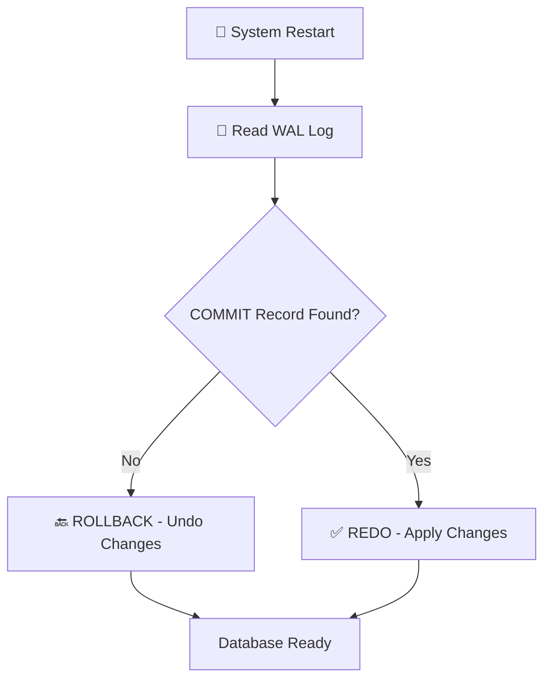

# Atomicity: Examples & Crash Recovery 🛠️

## 1. The Classic Bank Example 🏦

**Scenario:** Sending $100 from Account A to Account B.

* **Initial State:** Account A: $1000, Account B: $500.

### Without Atomicity (The Disaster) ❌

```text
1. UPDATE Account A = 900  ✅ (Success)
2. 💥 CRASH! (Power Failure)
3. UPDATE Account B = ???  ❌ (Never executed)

Result: $100 vanished into thin air!
```

### With Atomicity (The Safe Way) ✅

```text
1. UPDATE Account A = 900  ✅
2. 💥 CRASH!
3. System Restart → Checks WAL → No COMMIT found
4. Auto-Rollback → Account A restored to $1000

Result: Transaction failed safely. No data loss!
```

---

## 2. Recovery Flow Diagram 🔄



---

## 3. How Recovery Works? (The Cleanup) 🧹

Restart ayinappudu Database ventane online loki raadu. First **Cleanup Process** start chestundi:

1. **Scan WAL** - "Evaru sagam lo aagipoyaru?" ani vetukutundi
2. **Check COMMIT** - Commit kanipinchani transactions identify chestundi
3. **Rollback** - Incomplete transactions ni forcefully rollback chestundi
4. **Go Online** - Cleaning ayyake users ki access istundi

---

## 4. Savepoint Example (Partial Rollback) 💾

```sql
BEGIN;
    INSERT INTO orders VALUES (1, 'Product A');
    SAVEPOINT sp1;
    INSERT INTO orders VALUES (2, 'Product B');
    -- Oops, something wrong with Product B
    ROLLBACK TO sp1;  -- Only Product B undone
    INSERT INTO orders VALUES (3, 'Product C');
COMMIT;  -- Product A and C saved!
```

---

## 🎯 Key Takeaways

| Scenario | Action | Result |
|:---|:---|:---|
| All queries succeed | COMMIT | Data saved permanently |
| Any query fails | ROLLBACK | Everything undone |
| Crash before COMMIT | Auto-Rollback | Data remains consistent |
| Crash after COMMIT | REDO from WAL | Data recovered |
