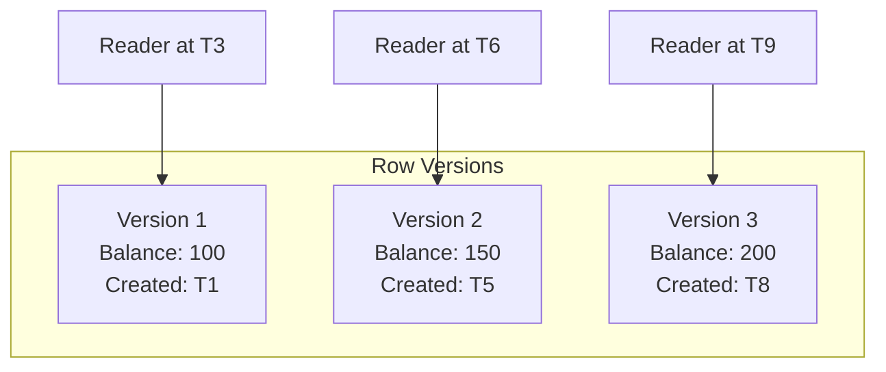

# Database Implementation: How Do They Do It? 🛠️

Database developers ee Isolation ni ela implement chestaru?

## Implementation Approaches Comparison

| Approach | Philosophy | Lock? | Performance | Used By |
|:---|:---|:---:|:---:|:---|
| **Pessimistic** | "Trust no one" | ✅ Yes | 🐢 Slower | SQL Server, Oracle |
| **Optimistic** | "Trust, then verify" | ❌ No | 🚀 Faster | MongoDB, DynamoDB |
| **MVCC** | "Keep all versions" | ❌ No | 🚀 Fast | PostgreSQL, MySQL |

---

## 1. Pessimistic Locking (The "Bhayam" Approach) 🔒

**Concept:** "Evaraina na data ni touch chestaremo ani bhayam."

```sql
-- Explicit Lock in SQL
SELECT * FROM accounts WHERE id = 1 FOR UPDATE;
-- This row is now LOCKED until COMMIT/ROLLBACK

-- Other transactions trying to access will WAIT
```

### Lock Types

| Lock | Blocks | Use Case |
|:---|:---|:---|
| **Shared (S)** | Writes only | Multiple readers OK |
| **Exclusive (X)** | Everything | Only one writer |
| **Row Lock** | Specific row | Fine-grained |
| **Table Lock** | Entire table | Coarse-grained |

---

## 2. The Deadlock Problem 💀

When two transactions wait for each other forever:


### Deadlock Detection

| Strategy | How It Works |
|:---|:---|
| **Timeout** | Kill transaction if waiting too long |
| **Wait-Die** | Older TX waits, younger dies |
| **Wound-Wait** | Older TX kills younger, then proceeds |
| **Detection Graph** | Find cycles in wait graph, kill one |

---

## 3. Two-Phase Locking (2PL) Protocol 📋

The rule that prevents conflicts:

```text
Phase 1: GROWING    Phase 2: SHRINKING
─────────────────┬─────────────────
  Acquire Locks  │  Release Locks
   🔒 🔒 🔒     │    🔓 🔓 🔓
       ↑         │
   Lock Point    │
```

**Rule:** Once you release ANY lock, you cannot acquire new locks.

---

## 4. Optimistic Concurrency (The "Nammakam" Approach) 🤞

**Concept:** "Evaru touch cheyyaru le" - No locks, verify at end.

```sql
-- Read current version
SELECT balance, version FROM accounts WHERE id = 1;
-- Returns: balance=100, version=5

-- Update with version check
UPDATE accounts 
SET balance = 150, version = 6 
WHERE id = 1 AND version = 5;

-- If affected rows = 0, someone else changed it!
-- → Retry the entire transaction
```

---

## 5. MVCC (Multi-Version Concurrency Control) 📸

**Concept:** Keep multiple versions of data - readers never block writers!



### How MVCC Works

| Transaction | Sees | Why |
|:---|:---|:---|
| Started at T3 | Version 1 | Snapshot from T3 |
| Started at T7 | Version 2 | Snapshot from T7 |
| Current (T10) | Version 3 | Latest committed |

---

## 🎯 Key Takeaways

1. **Pessimistic** - Safe but slow (locks everywhere)
2. **Optimistic** - Fast but may need retries
3. **MVCC** - Best of both worlds (PostgreSQL's secret)
4. **Deadlocks** - Real problem, needs handling strategy
5. **2PL** - Classic protocol for consistency
