# Consistency: The Rule Keeper 🏗️

## 1. What is Consistency in Data?

Consistency ante **"Correctness"**. Database eppudu oka "Valid State" nundi inkoka "Valid State" ki vellali.

* **Defined by User:** Idi database automatic ga chesedi kadu (like Atomicity). Developer (nuvve) define chese Rules meeda depend ayyi untundi.
* **The Tools:** Foreign Keys, Unique Constraints, CHECK Constraints, Triggers.

---

## 2. Referential Integrity (The Link) 🔗

Oka table lo unna data inkoka table tho correct ga link ayyi undali.

```sql
-- ❌ BAD: Orphan Record
INSERT INTO likes (photo_id, user_id) VALUES (999, 1);
-- Photo 999 doesn't exist -> Referential Integrity Violated!

-- ✅ GOOD: With Foreign Key Constraint
CREATE TABLE likes (
    id INT PRIMARY KEY,
    photo_id INT REFERENCES photos(id),  -- FK Constraint
    user_id INT REFERENCES users(id)
);
-- Now DB won't allow orphan records!
```

---

## 3. The Instagram Example 📸

| Table | Data | Problem |
|:---|:---|:---|
| **Photos** | Photo ID 1 has "5 Likes" (count column) | ⚠️ Count says 5 |
| **Likes** | Only 2 rows for Photo ID 1 | ⚠️ Reality is 2 |
| **Conflict** | 5 ≠ 2 | **Inconsistent State!** |

**Solution:** Use Triggers or calculate count dynamically instead of storing it.

---

## 4. Consistency = Result of A & I 🤝

Consistency anedi Atomicity and Isolation correct ga pani chesthe vache **Result**.

```mermaid
flowchart LR
    A[Atomicity ⚛️] --> C[Consistency ✅]
    I[Isolation 🛡️] --> C
    C --> V[Valid Database State]
```



| If This Fails... | Then... |
|:---|:---|
| **Atomicity** | Sagam money cut, credit avvakapothe → Inconsistent |
| **Isolation** | Wrong calculation valla Count update → Inconsistent |

---

## 🎯 Key Takeaways

1. **Developer's Responsibility** - DB provides tools, you define rules
2. **Foreign Keys** - Prevent orphan/dangling references
3. **CHECK Constraints** - Validate business rules (`balance >= 0`)
4. **Triggers** - Enforce complex consistency rules
5. **A + I = C** - Consistency is the outcome, not the mechanism
