# Consistency in Reads: Timing & Delays ⏱️

Idhi modern Distributed Databases (Master-Slave) lo chala pedda topic.

## 1. What is Consistency in Reads?

Simple Question: **"Nenu ippude oka change ni COMMIT chesa. Ventane Read chesthe aa change naku kanipistunda?"**

| Type | Answer | Example |
|:---|:---|:---|
| **Strong Consistency** | ✅ Yes, immediately | Bank Balance |
| **Eventual Consistency** | ⏳ Eventually, after delay | Social Media Likes |

---

## 2. The Master-Slave Delay 🐢

Pedda systems lo Data ni copy (Replication) chesetappudu time padutundi.

```mermaid
sequenceDiagram
    participant User
    participant Master as Master DB
    participant Slave as Slave DB
    
    User->>Master: UPDATE photo = 'new.jpg'
    Master->>Master: ✅ Saved!
    Master-->>Slave: Syncing... 🐢
    Note over Slave: Still has old data
    User->>Slave: SELECT photo
    Slave-->>User: ❌ Returns 'old.jpg'
    Note over User: 😕 Stale Read!
```

---

## 3. Strong vs Eventual Consistency ⚖️

| Aspect | Strong Consistency | Eventual Consistency |
|:---|:---|:---|
| **Read After Write** | ✅ Always latest | ⏳ May be stale |
| **Performance** | 🐢 Slower | 🚀 Faster |
| **Availability** | Lower | Higher |
| **Use Case** | Banking, Payments | Social Media, Analytics |
| **CAP Trade-off** | Consistency > Availability | Availability > Consistency |

---

## 4. Eventual Consistency (The Compromise) 🤝

"Kangaru padaku, ippudu kakapoina **Eventually** (koncham sepatiki) data correct ga vasthundi."

* **Why use it?** Speed kosam. Prathi sari Master ni adigithe slow avtundi.
* **Reality:** NoSQL (MongoDB, Cassandra) and even SQL Read Replicas lo common.

---

## 5. CAP Theorem (Brief) 📐

Distributed systems lo **only 2 out of 3** guarantee cheyyagalam:

* **C**onsistency - All nodes see same data
* **A**vailability - Every request gets response
* **P**artition Tolerance - System works despite network failures

> Banks choose **CP** (Consistency + Partition Tolerance)  
> Social Media chooses **AP** (Availability + Partition Tolerance)

---

## 🎯 Key Takeaways

1. **Read Consistency ≠ Data Consistency** - Different concepts
2. **Replication Lag** - Root cause of read inconsistency
3. **Trade-off** - Speed vs Freshness
4. **Design Choice** - Based on business requirements
