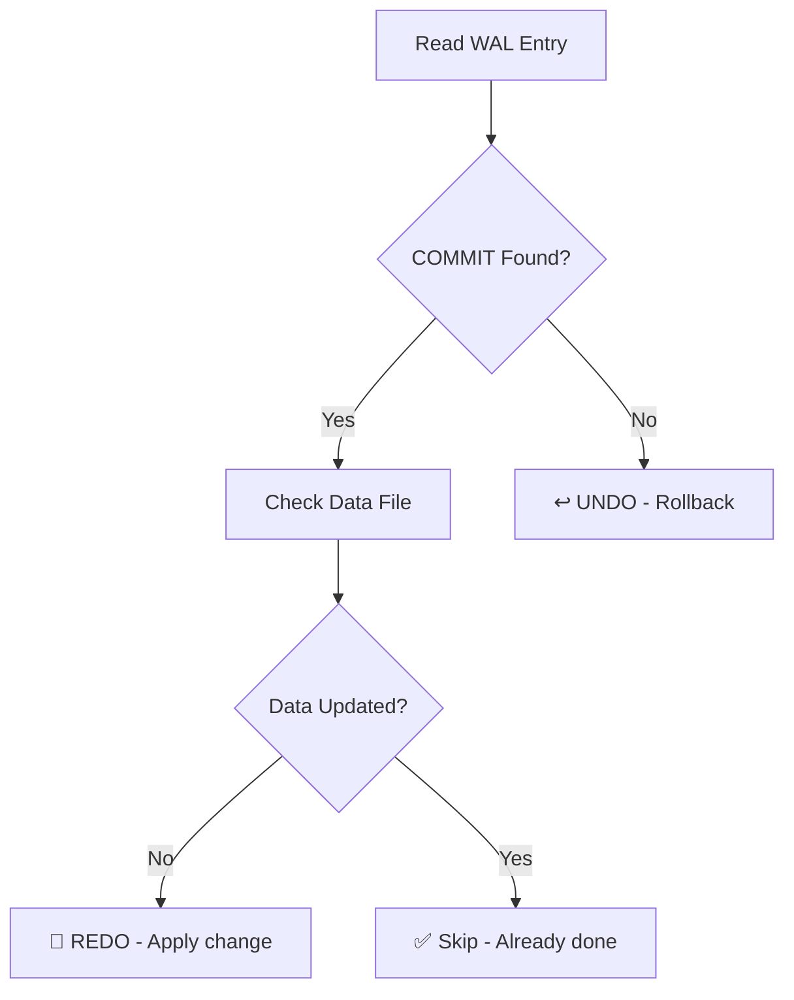
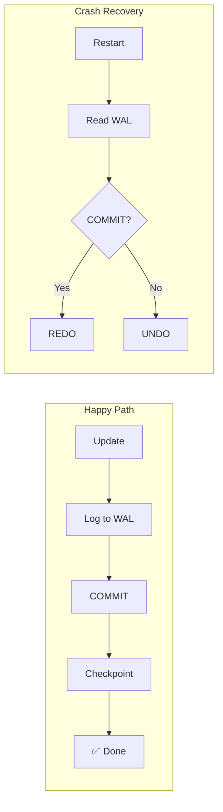

# Durability: Advanced Deep Dive & Edge Cases 🧠

Manam discuss chesina Critical Doubts and vatiki Technical Answers.

## 1. Atomicity vs. WAL: Who Guarantees Rollback?

| Concept | Role |
|:---|:---|
| **Atomicity** | The **Rule** - "All or Nothing" |
| **WAL** | The **Tool** - Stores undo information |

> WAL lekapothe Atomicity pani cheyyadu. Tool lekunda Rule implement cheyyalemu!

---

## 2. Commit vs. WAL: The Misconception ⚠️

```text
❌ Common Belief:
   COMMIT → Data saved to Tables on Disk

✅ Reality:
   COMMIT → Only WAL saved to Disk!
            Tables updated later (Checkpoint)
```

### Why This Design?

| Operation | I/O Type | Speed |
|:---|:---|:---|
| Update Tables | Random I/O | 🐢 Slow |
| Append to WAL | Sequential I/O | 🚀 Fast |

---

## 3. The Recovery Logic: Undo vs Redo 🔄

### Decision Tree



---

## 4. The Checkpoint Danger: Dirty Writes 💣

**Scenario:** Checkpoint runs BEFORE Commit!

```text
Timeline:
1. UPDATE Balance 100 → 200 (in RAM)
2. Checkpoint runs → Writes 200 to Disk ⚠️
3. (User hasn't committed yet!)
4. 💥 Power Cut
5. Restart: Disk shows 200... but no COMMIT!

The Fix:
1. DB reads WAL
2. Sees: "Changed 100 → 200" + "No COMMIT"
3. Action: Overwrite 200 with 100 (Original value from WAL)
4. Disk meeda em unna parvaledu - WAL is the truth!
```

---

## 5. Summary: The Durability Flow



---

## 🎯 Key Takeaways

1. **WAL enables Atomicity** - Without log, can't rollback
2. **COMMIT ≠ Table Update** - Only log is saved immediately
3. **WAL > Data Files** - Always trust the log
4. **Checkpoint can be dangerous** - But WAL handles it
5. **Recovery is automatic** - ARIES algorithm does the magic
